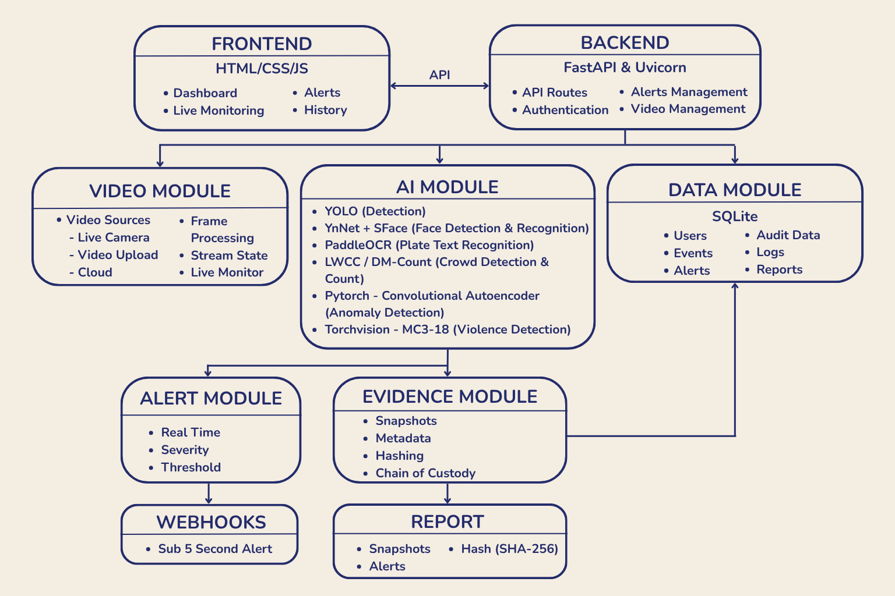

# N.E.T.R.A

## Networked Event Tracking, Recognition & Analysis

## Problem Statement

Surveillance environments generate large volumes of video from different sources, making continuous manual monitoring difficult and time-consuming. Identifying events such as weapons, violence, anomalies, crowd activity, number plates, and persons of interest across video sources requires an automated and centralized approach.

## Solution

N.E.T.R.A is an AI-powered video analytics and monitoring platform that brings multiple video sources and AI detection capabilities into a unified monitoring interface. It uses intelligent frame sampling to reduce unnecessary computation, applies multiple AI models for event detection, generates timestamped events and evidence, provides configurable alerting, and supports investigation through searchable activity history and forensic reports.

## Features

* **Multi-Source Video Analysis** — Supports uploaded videos, RTSP streams, webcam input, and Google Drive videos.
* **Real-Time Analytics** — Detects weapons, violence, anomalies, crowd activity, license plates, and persons of interest.
* **Intelligent Frame Sampling** — Selectively processes frames to reduce computational load during video analysis.
* **Person of Interest Recognition** — Allows operators to enroll POIs and identify matching faces during analysis.
* **License Plate Detection & OCR** — Detects license plates and extracts their text using OCR.
* **Custom Anomaly Detection** — Identifies abnormal activity using a Convolutional Autoencoder.
* **Unified Intelligence View** — Brings outputs from multiple AI modules into a single monitoring dashboard.
* **Configurable Alerting** — Supports configurable alert rules, watchlists, and cooldown-based alert handling.
* **Evidence Generation** — Generates snapshots, clips, annotated videos, and PDF reports from analysis results.
* **Tamper-Evident Evidence** — Uses SHA-256 hashing to preserve evidence integrity and traceability.
* **Advanced Activity Filtering** — Filters historical activity using parameters such as date range, operator, and event information.
* **Role-Based Access** — Provides administrator and operator access levels.
* **Audit Logging** — Maintains records of user and system activities.
* **Google Drive Integration** — Allows authorized users to retrieve videos directly from Google Drive.

## Project Structure & File Overview

```text
N.E.T.R.A-main/
│
├── backend/
│   ├── api.py
│   ├── auth.py
│   ├── database.py
│   ├── analysis_pipeline.py
│   ├── frame_processor.py
│   ├── alerting.py
│   ├── live_monitor.py
│   │
│   ├── inputs/
│   │   ├── analysis.py
│   │   ├── alerts.py
│   │   ├── live.py
│   │   ├── poi.py
│   │   └── upload.py
│   │
│   └── video_sources/
│       ├── file_source.py
│       ├── rtsp.py
│       ├── webcam.py
│       └── cloud.py
│
├── frontend/
│   ├── index.html
│   ├── css/
│   └── js/
│
├── models/
├── training/
├── SETUP_INSTRUCTIONS.md
├── API.md
├── schema.md
└── README.md
```

### Important Files

| File                           | Description                                                                                                    |
| ------------------------------ | -------------------------------------------------------------------------------------------------------------- |
| `backend/api.py`               | Main FastAPI application, API registration, frontend serving, storage initialization, and application startup. |
| `backend/auth.py`              | Handles authentication, sessions, roles, and access control.                                                   |
| `backend/database.py`          | Manages the SQLite database and persistent application data.                                                   |
| `backend/analysis_pipeline.py` | Controls video analysis, frame sampling, event generation, evidence creation, and result processing.           |
| `backend/frame_processor.py`   | Runs the AI and computer-vision models on sampled video frames.                                                |
| `backend/alerting.py`          | Processes detection events against configured alert rules and handles alert generation.                        |
| `backend/live_monitor.py`      | Manages live video monitoring and continuous frame processing.                                                 |
| `backend/inputs/`              | Contains the API route modules for analysis, uploads, live monitoring, alerts, and POI management.             |
| `backend/video_sources/`       | Provides the video-source implementations for files, RTSP streams, webcams, and cloud videos.                  |
| `frontend/`                    | Contains the monitoring dashboard, styling, and client-side functionality.                                     |
| `models/`                      | Contains the trained AI model weights used during inference.                                                   |
| `training/`                    | Contains training and evaluation resources for the implemented AI modules.                                     |

## Setup

For installation, environment configuration, and setup instructions, refer to:

[SETUP_INSTRUCTIONS.md](SETUP_INSTRUCTIONS.md)

## System Architecture



## Workflow


## Tech Stack

### Backend & API

* Python — Core application, backend logic, AI pipeline and video processing
* FastAPI — REST API and backend services
* Uvicorn — ASGI server for running the FastAPI application
* Pydantic — API request/response validation and data models

### AI / Machine Learning

* PyTorch — Deep-learning inference and custom anomaly detection
* Torchvision (MC3-18) — Video-model implementation for violence detection
* Ultralytics YOLO — Weapon detection and license-plate detection
* YuNet + SFace — Face detection and recognition
* PaddleOCR — License-plate text recognition
* LWCC / DM-Count — Crowd-density estimation
* Convolutional Autoencoder — Anomaly Detection
* Albumentations — Image/video preprocessing and augmentation
* NumPy — Numerical operations and frame processing

### Computer Vision & Video Processing

* OpenCV — Video capture, frame processing, RTSP streams, image processing, snapshots and video generation

### Frontend

* HTML5 — Web dashboard structure
* CSS3 — Dashboard styling and UI
* JavaScript — Dashboard interactions, API communication, live monitoring, alerts, uploads and history

### Database & Cloud

* SQLite — Users, events, alerts, evidence metadata, configuration and audit records
* Google Drive API — Cloud video retrieval
* Google Authentication / OAuth 2.0 — Google Drive authorization

### Alert & Report

* Webhooks — External real-time alert delivery
* ReportLab — PDF report generation

## API Documentation

The auromatically generated Swagger UI can be viewed upon starting the project at: 

http://127.0.0.1:8000/docs

The Swagger interface provides interactive documentation, request schemas, response structures, authentication requirements, and endpoint testing.

A supplementary API reference is available in:

[API.md](API.md)

## Database Schema

The database structure, tables, relationships, and integrity mechanisms are documented in:

[schema.md](schema.md)

## Innovation

### Intelligent Frame Sampling

Selectively processes video frames to reduce computational load while maintaining efficient analysis.

### Configurable External Webhook

Alerts can be automatically redirected to an external system by providing its webhook URL without requiring internal application changes.

### Unified Intelligence View

Brings outputs from multiple AI modules, including POI, weapons, violence, vehicles, anomalies, and other detected events, into a single monitoring interface.

### Custom Anomaly Detection

Uses a Convolutional Autoencoder to identify abnormal activity beyond predefined detection categories.

### Tamper-Evident Results

Uses SHA-256 hashing to preserve the integrity and traceability of analysis results.

### Advanced Activity Filtering

Allows operators to filter activity records using date range, operator, and other relevant parameters, making investigations faster and more focused.

## Video Demo

[Video Demo](VIDEO_LINK_HERE)

## Contributors

- Shravani Joshi
- Trisha Deshmukh
- Sanika Mane
- Bliss Gonsalves
